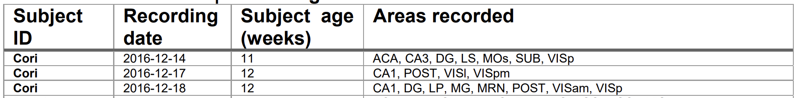

```{r,echo=F,results=F,message=F}
library(keras)
library(mlbench)
library(dplyr)
library(magrittr)
library(neuralnet)
library(matrixStats)
library(lme4)
library(caret)
library(plotrix)
library(gplots)

#knitr::opts_chunk(fig.pos='H',message=FALSE, warnings=FALSE)
```

```{r setup, include=FALSE} 
knitr::opts_chunk$set(warning = FALSE, message = FALSE) 
```
# Abstract

We explore a small subset of Steinmetz 2019 mouse behavior experiment to understand aggregation of unaligned statistics. Two methods are discussed, the first being a scalar summary statistic and the second a fixed time series of summary statistics.  

# Introduction and Experimental Background

Experimental data often is riddled with heterogeneous sources of data. This is the result of conserving as many resources as possible. For this particular study, there is only a finite amount of region on which a scientist can record neurons from a mouse's brain. Therefore, one must be economical, recording different regions per experimental session. This report seeks to draw conclusions despite this non-uniformity in recorded data. 

The experiment performed by Steinmetz et al. specifically sought to predict the ability for a mouse to recognize stimuli, by the following procedure: 

1. Light at various levels of contrast was displayed to the left and right of a given mouse. 

2. Mice were expected to select turn the wheel in the direction of the highest contrast. 

3. A success was recorded when the turn was in the correct direction. A fail was recorded when the wheel was turned in the incorrect direction. Lastly, a miss is recorded if the mice chose never to spin the wheel. 


However, irregularity is introduced because of the limited resources to record every neuron. Instead, areas of the brain were selected, as indicated by the table below, which is an excerpt from Steinmetz, N.A., Zatka-Haas, P., Carandini, M. et al. :




Notice that some regions are common between sessions, but no sample is shared by every session. The purpose of this project is to answer the following questions: 

1. How do neurons in the visual cortex respond to the stimuli presented on the left and right?

2. How to predict the outcome of each trial using the neural activities and stimuli?

We answer both of these questions via considering multiple models of inference. The models we consider are the following:

1. Scalar value model: We transform the 2 dimensional data structure into a single scalar summary statistic and attempt to predict the outcome based off this value.
2. Fixed length time series: Since every recorded trial is of 39 fixed time steps, we can collate a fixed vector for every trial using column-wise summary statistics. 

# Datasource description

Five sessions of variable length observed samples were collected on the mice and dates listed in the aforementioned excerpt. A variable number of trials are performed during each session. Five variables are available for each trial, namely 

- `feedback_type`: type of the feedback, 1 for success and -1 for failure
- `contrast_left`: contrast of the left stimulus
- `contrast_right`: contrast of the right stimulus
- `time`: centers of the time bins for `spks`  
- `spks`: numbers of spikes of neurons in the visual cortex in time bins defined in `time`

For each session, we list the number of samples, as well as the number of 

```{r echo=FALSE, eval=TRUE, include=FALSE}
session=list()
for(i in 1:5){
  cat("Session: ", i, "\n")
  session[[i]]=readRDS(paste('./Data/session',i,'.rds',sep=''))
  cat("Mouse Name:", session[[i]]$mouse_name,"\n")
  cat("Data of Session:", session[[i]]$date_exp,"\n")
  cat("Number of Recorded Samples:", length(session[[i]]$feedback_type), "\n")
  for(id in 1:length(session[[i]]$feedback_type)) {
    my_dims <- dim(session[[i]]$spks[[id]])
    M <- session[[i]]$spks[[id]]
    cellcolors <- unlist(M)
    cellcolors <- ifelse(cellcolors == 0, "white", ifelse(cellcolors == 1, "red", "blue"))
    cat("Dimension of Recorded Samples:", my_dims,"\n")
    color2D.matplot(M,main="Visual Representation of Record Spikes",xlab="Time Step", ylab="Recorded Spike",cellcolors = cellcolors, border=NA)
   break 
  }
  cat("\n")
}
```

| Session                       | 1          | 2          | 3          | 4          | 5          |
|-------------------------------|------------|------------|------------|------------|------------|
| Mouse Name                    | Cori       | Cori       | Cori       | Forssmann  | Forssmann  |
| Date of Session               | 2016-12-14 | 2016-12-17 | 2016-12-18 | 2017-11-01 | 2017-11-02 |
| Number of Recorded Samples    | 214        | 251        | 228        | 249        | 254        |
| Dimension of Recorded Samples | 178 39     | 533 39     | 228 39     | 120 39     | 99 39      |

An example of the type of recorded spikes visualized is the following 533 x 39 grid recorded during session 2: 

```{r echo=FALSE, eval=TRUE}

    M <- session[[2]]$spks[[1]]
    cellcolors <- unlist(M)
    cellcolors <- ifelse(cellcolors == 0, "white", ifelse(cellcolors == 1, "red", "blue"))
    color2D.matplot(M,main="Visual Representation of Record Spikes",xlab="Time Step", ylab="Recorded Spike",cellcolors = cellcolors, border=NA)

```

Clearly, this task is very challenging to try and reverse engineer the relationship between stimuli and their effect on neural activity. 

# Scalar Value Model

In order to transform this sequence problem into an approachable one within the scope of this course, 
we use summary statistics on the neuron firing rate. Each neuron has a firing rate defined by: 


$$\left \{ \sum_{i = 1}^{38} \frac{1}{\Delta t}|f_{j,i+1} - f_{j,i}| \right \}_{j = 1}^{\#\text{neurons}}$$
In the report, $\Delta t = 0.4$. Further, we can then synthesize the follow summary statistics based of the distribution. 

- `minimum_firing_rate`
- `lower_quartile_firing_rate`
- `median_firing_rate`
- `upper_quartile_firing_rate`
- `maximum_firing_rate`
- `mean_firing_rate`

In order to avoid repetition, we begin the analysis with the mean firing response. 

```{r echo=FALSE, eval=TRUE, include=FALSE}
my_data <- data.frame(matrix(ncol = 12, nrow = 0))
colnames(my_data) <- c('session', 'trial','contrast_left', 'contrast_right',  'num_neurons_collected','min_response','lower_quartile_response','median_response','upper_quartile_response','max_response','mean_response','feedback')

for(t in 1:5){
  for(id in 1:length(session[[t]]$feedback_type)) {
    curr_feedback <- session[[1]]$feedback_type[id]
    curr_left_contract <- session[[t]]$contrast_left[id]
    curr_right_contract <- session[[t]]$contrast_right[id]
    
    # define test statistics here
    my_dims <- dim(session[[t]]$spks[[id]])
    
    M <- session[[t]]$spks[[id]]

    rate_of_change <- c(1:my_dims[2] - 1)
    
    for(k in 1:(my_dims[2] - 1)) {
      rate_of_change[k] <- sum(abs(c(M[,k + 1]) - c(M[,k]))) / (session[[t]]$time[[id]][k + 1] - session[[t]]$time[[id]][k])
    }
    
    rate_of_change <- rate_of_change / my_dims[1]
    
    my_quans <- quantile(rate_of_change)
    
     if(is.na(curr_feedback)) {
      curr_feedback <- -1
    }
    
    my_data[nrow(my_data) + 1,] = c(t, id, curr_left_contract, curr_right_contract, my_dims[1], my_quans[[1]], my_quans[[2]], my_quans[[3]], my_quans[[4]], my_quans[[5]], mean(rate_of_change), (curr_feedback + 1) / 2)
  }
}
head(my_data)
```

## Testing for Random Effects 

Before we undergo the main analysis, we want to consider a mixed effect model for the two fixed-effect factors of left and right contrast. 
Firstly, we would like to test whether we can reject the random effect of session on our stimuli. Observe, we employ two tests: 

- F test

```{r echo=TRUE, eval=TRUE, include=TRUE} 
fit.aov = aov(mean_response ~ session, data = my_data)
summary(fit.aov)
```

$$MSTR = 2754.0, MSE = 0.2417, $$

$$F = \frac{MSTR}{MSE} = 2114 \implies \text{p-value} = 2e-16$$

- LR Chi-Squared test


```{r echo=TRUE, eval=TRUE, include=TRUE} 

rand_effects_mod <- lmer(mean_response ~  (1 | session), data = my_data)
rand_effects_mod_reduced <- lm(mean_response ~ 1, data = my_data)
anova(rand_effects_mod, rand_effects_mod_reduced)
```

$$\chi^2_1 = 1402 \implies \text{p-value} = 2.2e-16$$

If we consider a typical significance value of $\alpha = 0.01,$ then see that both of these tests disprove the null hypothesis. Therefore, we should include random effects within our model assumptions as a way of being able to generalize to more sessions, which are available within the Steinmetz report. 

## Testing for Mixed-Effect Interactions

Let us consider the two-factor model of the form: 

$$Y_{i,j,k} = \mu + \alpha_i + \beta_j + (\alpha \beta)_{i,j} + \epsilon_{i,j,k}$$

where $\alpha_i$ corresponds to the factors of left stimuli, while $\beta_j$ corresponds to the factors of right stimuli. We want to predict the mean response $Y_{i,j,k}$ based off these values. We can consider the main effects and interaction plots between each stimuli and the mean firing rate. 


```{r echo=FALSE, eval=TRUE} 

par(mfrow=c(1,2))
plotmeans(mean_response~ contrast_left,data=my_data,xlab="Contrast Left",ylab="Mean Firing Rate", main="Main effect, Contrast Left") 
plotmeans(mean_response~ contrast_right,data=my_data,xlab="Contrast Right",ylab="Mean Firing Rate", main="Main effect, Contrast Right") 
```

Notice for these main effect plots, the confidence intervals for contrast right have less overlap than those of contrast left. This suggests that contrast right might serve as a better variable for prediction later, which corroborates the findings found late in this report. Also, upon exploring the interaction plots,

```{r echo=FALSE, eval=TRUE} 
par(mfrow=c(2,2))

interaction.plot(my_data$contrast_left,my_data$session,my_data$mean_response,xlab="Contrast Left",ylab="Session", main="Contrast Left and Mean Firing Rate")
interaction.plot(my_data$contrast_right,my_data$session,my_data$mean_response,xlab="Contrast Right",ylab="Session", main="Contrast Right and Mean Firing Rate")
interaction.plot(my_data$contrast_left * my_data$contrast_right,my_data$session,my_data$mean_response,xlab="Contrast Left:Contrast Right",ylab="Session", main="Contrast Right:Contrast Left and Mean Firing Rate")
```

we notice the overwhelming trend that the mean response decreases per session. This further illustrates the need to use a random intercept for session as explored above. 

Firstly, we want to test the following hypothesis:

$$H_0 : (\alpha \beta)_{i,j} = 0 \text{ for all } i,j$$
against the alternative hypothesis, which is:

$$H_A : (\alpha \beta)_{i,j} \not = 0 \text{ for some } i,j$$

To do so, consider the following main effects and interaction plots, in addition to the 


```{r echo=FALSE, eval=TRUE} 

rand_effects_mod <- lmer(mean_response ~ as.factor(contrast_right)*as.factor(contrast_left)  + (1 | session), data = my_data)
rand_effects_mod_reduced <- lmer(mean_response ~ as.factor(contrast_left) + as.factor(contrast_right) + (1 | session), data = my_data)
anova(rand_effects_mod, rand_effects_mod_reduced)

```

We see that we do not in this case reject the hypothesis that the interaction term coefficient is zero. Therefore, for the sake of brevity, we will assume this value is zero for the remainder of this section. 

## Predicting Neural Activity from Stimuli

Observe, we can perform the following analysis of variations: 

```{r echo=TRUE, eval=TRUE} 
mean_response_model <- lmer(mean_response ~ as.factor(contrast_right) + as.factor(contrast_left) + (1 | session), data = my_data)
plot(mean_response_model)
anova(mean_response_model)
```

Indeed, it appears we don't see significant departures heterogeneity. Therefore, we can analyze the coefficients in order to draw some conclusions. Specifically, we consider the coefficients relating contrast right and contrast left to the mean response. 

```{r echo=FALSE, eval=TRUE} 
confint(mean_response_model)
```

We see that as we increase the contrast on either the left or the right, neural activity INCREASES! We expect this relationship to be similar for the other summary statistics because of the high correlation between all of the summary statistics, as indicated by the coefficient table below:

```{r echo=FALSE, eval=TRUE} 
panel.cor <- function(x, y){
  par(usr = c(0, 1, 0, 1))
  r <- round(cor(x, y, use="complete.obs"), 2)
  txt <- paste0("R = ", r)
  cex.cor <- 0.8/strwidth(txt)
  text(0.5, 0.5, txt, cex = cex.cor * r)
}

minimum_firing_rate <- my_data$min_response
lower_quartile_firing_rate  <- my_data$lower_quartile_response
median_firing_rate <- my_data$median_response
upper_quartile_firing_rate <- my_data$upper_quartile_response
maximum_firing_rate <- my_data$max_response
mean_firing_rate <- my_data$mean_response
left_contrast <- my_data$contrast_left
right_contrast <- my_data$contrast_right
pairs(~minimum_firing_rate + lower_quartile_firing_rate + median_firing_rate + upper_quartile_firing_rate + maximum_firing_rate + mean_firing_rate + left_contrast + right_contrast, lower.panel = panel.cor)
```


## Predicting Outcome using Neural Activity and Stimuli

We perform a consistent train and test split, with a training set of 100 instances. 


In order to avoid potential over fitting, we employed using step wise regression. With a final score of BIC = 1571.64, the recommended model is 

$$\text{feedback} = \text{logistic}(\text{mean_response})$$

This result makes sense because in the previous section, we explored the coefficients of other scalar summary statistics and found them to be highly correlated ($\geq 95\%$ correlation!).
```{r echo=TRUE, eval=TRUE, include = FALSE} 
train_data <- my_data[101:nrow(my_data),]
test_data <- my_data[1:100,]

full_model <- glm(feedback ~ min_response + lower_quartile_response + median_response + upper_quartile_response + max_response + mean_response + as.factor(contrast_right) + as.factor(contrast_left), data = train_data)

reduced_model <- lm(feedback ~ 1, train_data )

step(full_model, scope=list(lower=reduced_model, upper=full_model),
    criterion = "BIC", direction="both", k = log(nrow(train_data)))
```

Naturally, we use the trained threshold of 0.5. This results in the following confusion matrix. 

```{r echo=TRUE, eval=TRUE} 
prediction_model <- glm(feedback ~  mean_response, data = train_data)
y_hat <- round(predict(prediction_model, test_data))

confusionMatrix(data = as.factor(y_hat), reference = as.factor(test_data$feedback))
```


Notice, this model is only predicting 1 for every instance on the test set. Therefore, it's likely that mean response is not a sufficient statistic for feedback. Instead, we need to turn towards more representative statistics to try and improve upon prediction. 


# Using Fixed Length Time Series Summary Statistics

Now, instead of aggregating by neuron AND time step, we instead aggregate over all neurons for each individual time step. This leads naturally to two summary statistics: 

- `mean_at_t`
- `max_at_t`

where $1 \leq t \leq 39.$


```{r echo=TRUE, eval=TRUE, include=FALSE}


my_data <- data.frame(matrix(ncol = 83, nrow = 0))
my_data_colnames <- c('session', 'trial','contrast_left', 'contrast_right')

for (t in 1:39) {
  my_data_colnames <- append(my_data_colnames, paste("mean_at_", t, sep=""))
}

for (t in 1:39) {
  my_data_colnames <- append(my_data_colnames, paste("max_at_", t, sep=""))
}

my_data_colnames <- append(my_data_colnames, "feedback")

colnames(my_data) <- my_data_colnames

for(t in 1:5){
  for(id in 1:length(session[[t]]$feedback_type)) {
    curr_feedback <- session[[1]]$feedback_type[id]
    curr_left_contract <- session[[t]]$contrast_left[id]
    curr_right_contract <- session[[t]]$contrast_right[id]

    # define test statistics here
    my_dims <- dim(session[[t]]$spks[[id]])

    M <- session[[t]]$spks[[id]]

    mean_response_over_time <- rowMeans(t(M))

    max_response_over_time <- rowMaxs(t(M))
    
    curr_result <- append(mean_response_over_time, max_response_over_time)
    
    row_info <- c(t, id, curr_left_contract, curr_right_contract)
    curr_result <- append(row_info, curr_result)
    
    if(is.na(curr_feedback)) {
      curr_feedback <- -1
    }

    my_data[nrow(my_data) + 1,] = append(curr_result, (curr_feedback + 1) / 2)
  }
}
head(my_data)

train_data <- my_data[101:nrow(my_data),]
test_data <- my_data[1:100,]

```


## Predicting Feedback

Now that there are significantly more features per instance (80 total), it's recommended that to avoid overfitting, I perform step-wise regression analysis. Upon running, a model with a BIC Score of  1556.05 was recommended, with the following features: 

$$\text{feedback} ~ \text{logistic}( \text{contrast_right + mean_at_23 + + mean_at_31 + max_at_5} )$$

```{r echo=TRUE, eval=TRUE, include=FALSE} 


fmla_str <- "feedback ~ contrast_left + contrast_right +"
xnam <- paste("mean_at_", 1:39, sep="")
total_vars <- paste(xnam, collapse= " + ")

xnam <- paste("max_at_", 1:39, sep="")
total_vars_2 <- paste(xnam, collapse= " + ")

total_vars <- paste(total_vars,total_vars_2, sep=" + ")

fmla_str <- paste(fmla_str, total_vars)

fmla <- as.formula(fmla_str)

full_model <- glm(fmla, data = train_data)

reduced_model <- lm(feedback ~ 1, train_data )

step(full_model, scope=list(lower=reduced_model, upper=full_model),
    criterion = "BIC", direction="both", k = log(nrow(train_data)))

```

What can this mean? From the formula alone, it suggests that there might be a spike within a single neuron early within the time series at $t = 5$, while many neurons begin to fire at times $t = 23, 31$. Notice, we also get much more variation within our confusion matrix for this predictive model.  

```{r echo=TRUE, eval=TRUE} 

prediction_model <- glm(feedback ~ as.factor(contrast_right) + mean_at_23 + mean_at_31 + max_at_5, data = train_data)
y_hat <- round(predict(prediction_model, test_data))

confusionMatrix(data = as.factor(y_hat), reference = as.factor(test_data$feedback))

```

Though it appears this models accuracy is less than that of the previous model, notice that this model correctly predicts several of the fail feedback cases. That is, less false-positives are identified as a result of this change. This is a significant improvement. We also see an increase in sensitivity from the previous model with a small decrease in specificity. 


## Contrast versus Stimuli in Time Series

Using the results from the prediction model, we want to understand the relationship between several neurons and the contrast. Observe, we construct a new correlation table using only the subset of summary statistics that our prediction model deemed adequate for use:

```{r echo=FALSE, eval=TRUE} 
panel.cor <- function(x, y){
  par(usr = c(0, 1, 0, 1))
  r <- round(cor(x, y, use="complete.obs"), 2)
  txt <- paste0("R = ", r)
  cex.cor <- 0.8/strwidth(txt)
  text(0.5, 0.5, txt, cex = cex.cor * r)
}

mean_at_23 <- my_data$mean_at_23
mean_at_31  <- my_data$mean_at_31
max_at_5 <- my_data$max_at_5
contrast_right <- my_data$contrast_right
pairs(~ as.factor(contrast_right) + mean_at_23 + mean_at_31 + max_at_5, lower.panel = panel.cor)
```

We get a pearson correlation of 0.31 between mean_at_31 and contrast right. Observe, if we consider a random effects model between contrast on the right versus the mean response at $t = 31.$

```{r echo=FALSE, eval=TRUE,} 
mean_at_31_response_model <- lmer(mean_at_31 ~ as.factor(contrast_right) + (1 | session), data = my_data)
anova(mean_at_31_response_model)
```

Anova suggests a significant relationship between these two. Further, we turn towards the relevant coefficients; 


```{r echo=FALSE, eval=TRUE} 
confint(mean_at_31_response_model)
```

Notice that was we increase contrast on the right, we see a nonlinear relationship with the mean response. The contrast on the right at 50% causes the greatest increase in neural activity! Whereas, deviating to 25% or 100% decreases that activity. Then 0% has the least neural activity at $t = 31.$ 

## Nonlinear Modeling using Neural Networks

The last model of consideration is a neural network. This is done in the hopes of picking up on more nonlinear relationships between time series responses and stimuli. Observe, we consider a neural network of hidden layers 42 and 12. These numbers were chosen because 12 is the geometric mean of 80 divided by the percentage of remaining neurons after a dropout of 40% is applied. Similarly, 42 is the geometric mean of 80 and 12 divided by the percentage of remaining neurons after a dropout of 20% is applied. This results in the following pictorial representation of the architecture:  

```{r echo=FALSE, eval=TRUE}
n <- neuralnet(fmla,
               data = train_data,
               hidden = c(42,12),
               linear.output = F,
               lifesign = 'full',
               rep=1)

plot(n, rep="best",col.hidden = 'darkgreen',     
col.hidden.synapse = 'darkgreen',
     show.weights = F,
     information = F,
     fill = 'lightblue')
```

Observe, we have the following results:

```{r echo=FALSE, eval=TRUE} 


model <- keras_model_sequential()
model %>%
         layer_dense(units = 42, activation = 'relu', input_shape = c(78)) %>%
         layer_dropout(rate=0.4)  %>%
         layer_dense(units = 12, activation = 'relu')  %>%
         layer_dropout(rate=0.2)  %>%
         layer_dense(units = 1, activation = 'sigmoid')

model %>% compile(loss = 'binary_crossentropy',
optimizer = 'rmsprop', 
metrics = 'binary_accuracy') 


training <- train_data[,5:82]
trainingtarget <- train_data[, 83]

test <- test_data[,5:82]
testtarget <- test_data[, 83]

m <- colMeans(training)
s <- apply(training, 2, sd)
training <- scale(training, center = m, scale = s)
test <- scale(test, center = m, scale = s)

mymodel <- model %>%
fit(training,trainingtarget,
             epochs = 40,
             batch_size = 32,
             validation_split = 0.2)

pred <- model %>% predict(test)
y_hat <- matrix(round(pred), nrow=100, byrow=TRUE)
y_true <- matrix(test_data$feedback, nrow=100, byrow=TRUE)

confusionMatrix(data = as.factor(y_hat), reference = as.factor(y_true))

```


Notice the confusion matrix is similar to that of the previous GLM prediction model. However, more negative feedback cases are suggested. But the sensitivity and specificity of this model are relatively the same as the previous. Therefore, we don't see any significant improvement overall using this model.

# Conclusion

Is there a relationship between neural activity and stimuli presented? Yes, and it is substantiated above. However, the explicit relationship is hard to reverse engineer. The paper Steinmetz gave doesn't appear to match perfectly with the provided sessions. So the relationship between the recorded sample dimensions is not easily distilled into a representative set of brain regions. One suggestion is to use a Low-Dimensional Neuron Representation in which we reverse engineer the related neuron activity using clustering analysis. However, this can lead to spurious results as well as the need to then formulate a summary statistic for each cluster identified. Since there are 21 unique brain regions recoreded in the 5 sessions combined, its also unlikely that an aggreed upon cluster constant can be identified, which makes k-means clustering erroneous. The best way to substantiate this answer is to have a better representation break down AND using the other sessions data as well. I tried going to the internet to get this but I couldn't get more data. 


Is there a relationship between neural activity and stimuli on feedback? Yes, although spurious as well. It appears that when a contrast is presented, there is an initial spike early at $t = 5.$ And then a series of neurons fire at $t = 23$ and $t = 23$ to determine the feedback. However, this isn't obvious in our test set because the test set is likely attenuated to mouse that is in the early stages of learning the exercise discussed in the background. So the connections between neural activity and the correct feedback is not established. A better analysis would be to see the relationship between neural activity on feedback over time. However, this type of time series analysis is beyond this scope of this report (and 207 course material).

# Reference {-}


Steinmetz, N.A., Zatka-Haas, P., Carandini, M. et al. Distributed coding of choice, action and engagement across the mouse brain. Nature 576, 266–273 (2019). https://doi.org/10.1038/s41586-019-1787-x

Deep Neural Network in R
 https://www.r-bloggers.com/2021/04/deep-neural-network-in-r/
 
# Github {-}

You can find the repository for this report at https://github.com/gdepaul/207-Final-Project.git

# Appendix 

```{r ref.label=knitr::all_labels(), echo=TRUE, eval=FALSE}

```